```{r setup, include=FALSE}
library(flexdashboard)
library(emo)
```


### The environmental specimen bank at NRM


- 350 000 samples
- Oldest material from the mid 60s
- Majority of samples from two long-term projects

.pull-left[
```{r Contaminants, echo=FALSE, fig.cap="Contaminants monitoring", out.width = '85%'}
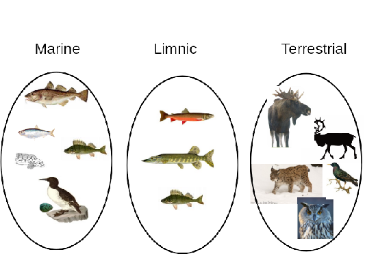
```
]
.pull-right[
```{r TopPredator, echo=FALSE, fig.cap="Top predator population monitoring", out.width = '75%'}
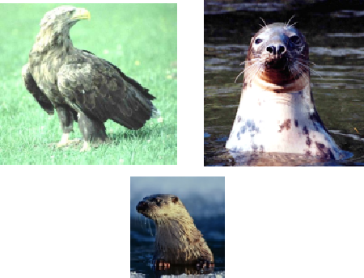
```
]

---

### Since 2015 DNA extractions is stored in the NRM ESB

- DNA extractions from the population monitoring of brown-bear in Sweden ~12000 samples
- eDNA samples - water, soil and sediment <500 samples
- Population genetic studies mostly tissue samples <1000 samples

.pull-left[

```{r Samples, echo=FALSE, fig.cap="", out.width = '75%'}
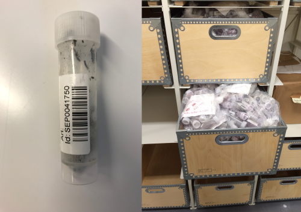
```
]

.pull-right[
```{r Filter, echo=FALSE, fig.cap="", out.width = '65%'}
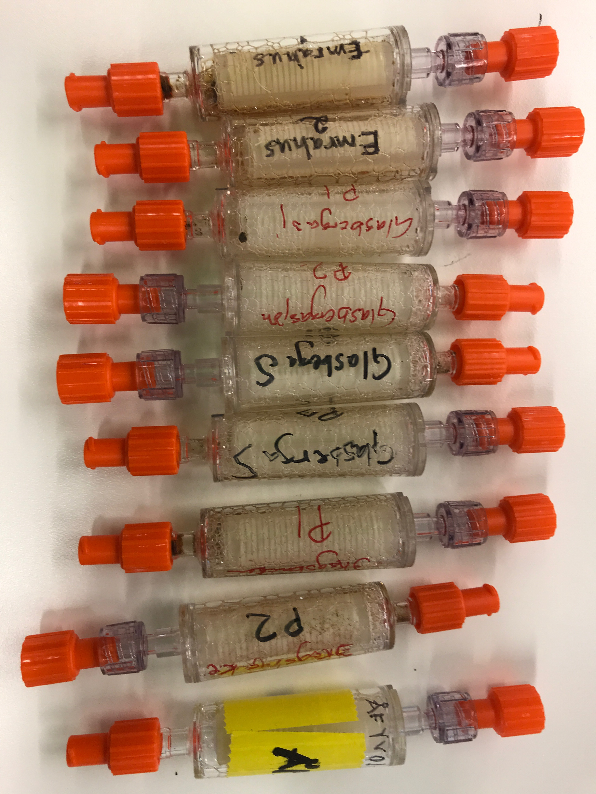
```
]

---

### DNA extractions worknig procedure

.pull-left[
- Unique identifiers are assigned upon arrival to the museum
- DNA extractions are done using in-house laboratory facilities
- Most of the extraction work are automated on robots that can handle up to 192 samples per hour
- Magnetic bead based procedures are preferred to retain high-molecular weight DNA if present, but adjustment are done based on type of samples.
]

.pull-right[
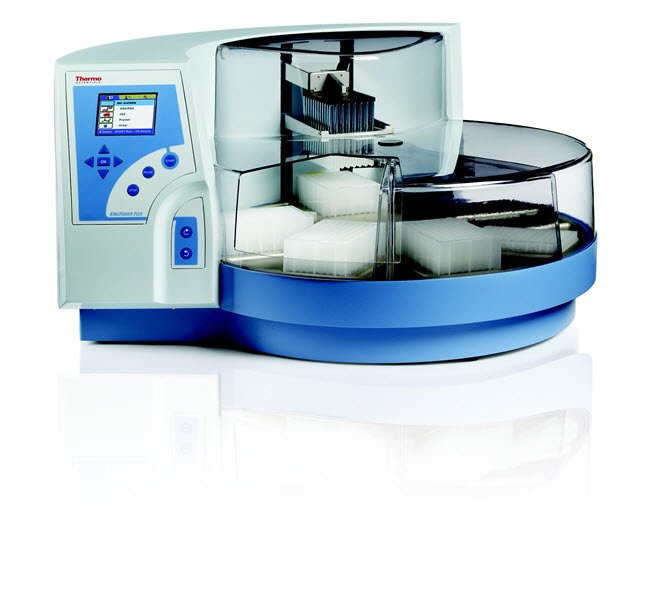

]

---

### Long term storage

.pull-left[
- Subset of the extraction directly transferred to long term storage tubes.
- Each extraction gets a unique identifier (QR-code at the bottom of the tube)
- 96 tubes stored in barcoded racks
- Samples and rack are scanned, each tube and rack get a unique identifier
]

.pull-right[
```{r Micronics, echo=FALSE, fig.cap="", out.width = '75%'}
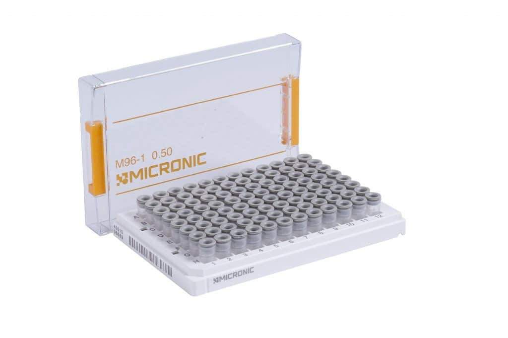
```

```{r Tracxer, echo=FALSE, fig.cap="", out.width = '75%'}
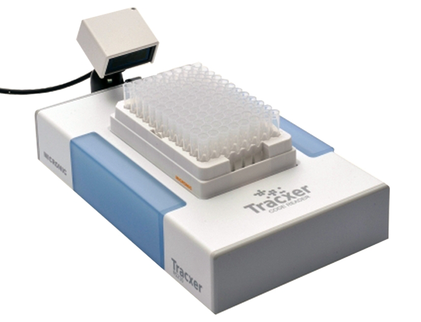
```
]

---

### SeqDB: LIMS and sample data base


```{r SeqDB1, echo=FALSE, fig.cap="", out.width = '130%'}
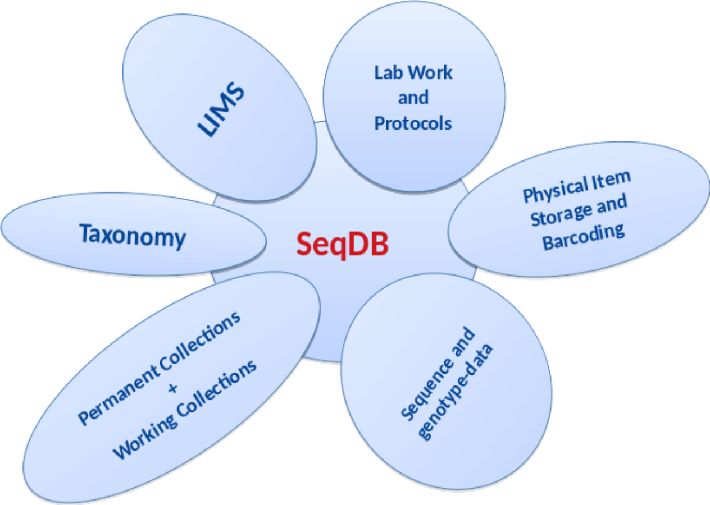
```

---

### SeqDB - Storage info

```{r SeqDB2, echo=FALSE, fig.cap="", out.width = '100%'}
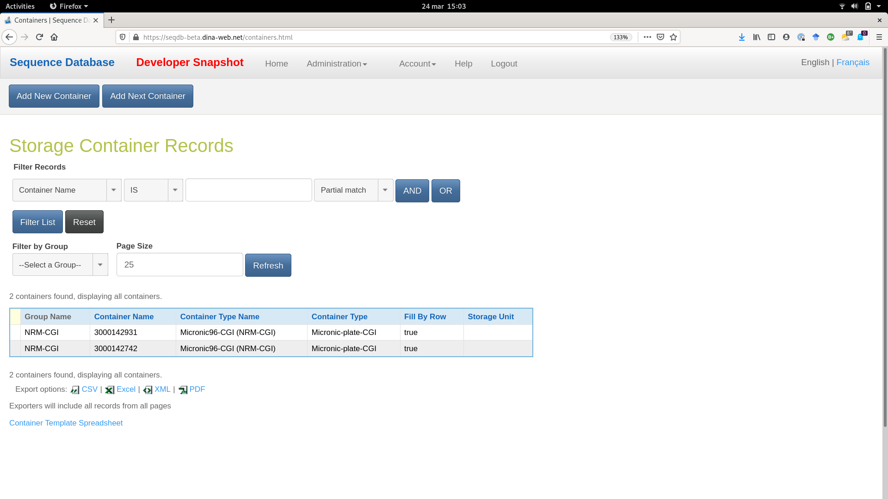
```

---

### SeqDB - Sample info

```{r SeqDB3, echo=FALSE, fig.cap="", out.width = '100%'}
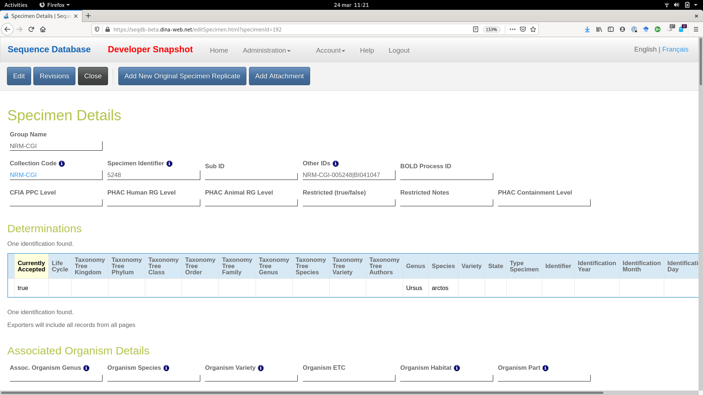
```

---

### Custom made public interface

```{r Seqpub, echo=FALSE, fig.cap="", out.width = '100%'}
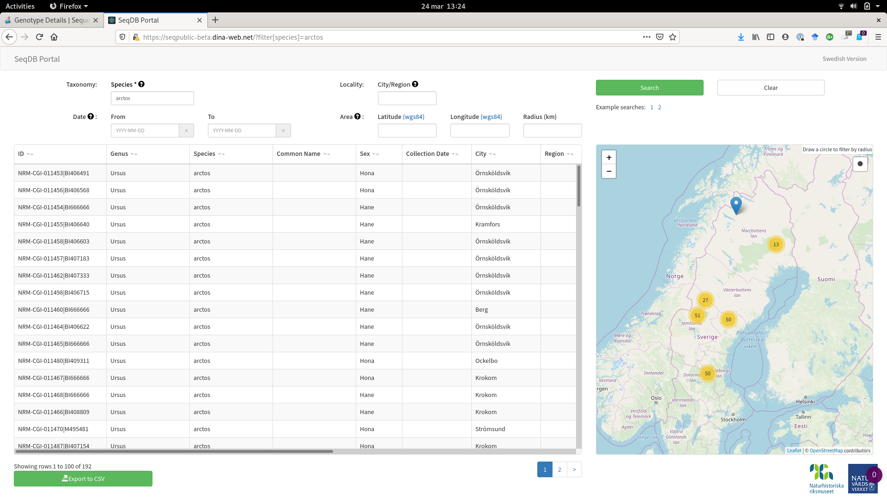
```

---

### Noteworthy features and technical details

- Customizable bulk import for easy import of large number of similar samples
- Customizable bulk edit - to make it easy to modify entries 
- Possible to make data available via API and system is compliant with Darwin core and MixS for easy export and integration with other systems. 
- Loans is currently handled via simple email requests, but the public interface will include forms to make loan requests based on highlighted samples

&nbsp;

.pull-left[
```{r post, echo=FALSE, fig.cap="PostgreSQL", out.width = '20%'}
knitr::include_graphics("Pictures/postgres.png")
```
]

.pull-right[

```{r docker, echo=FALSE, fig.cap="", out.width = '50%'}

```
]
---

### Credits

- Agriculture and Agri-Food Canada (AAFC) - SeqDB Developement

- Ingimar Erlingsson, dev-ops at NRM responsible for our local seqdb instance

- Sara Danielsson, head of the ESB at NRM for sharing lots of information for this presentation
