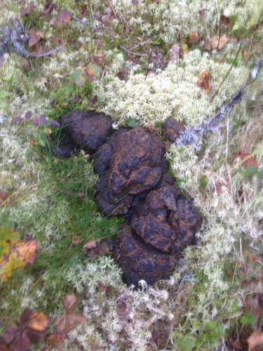
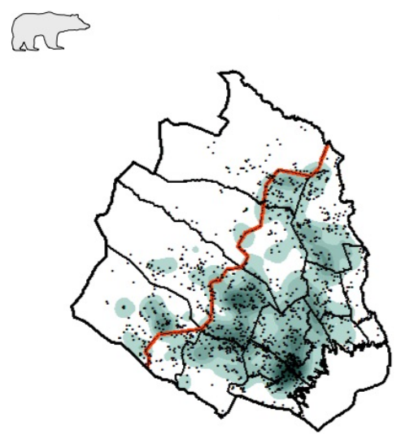
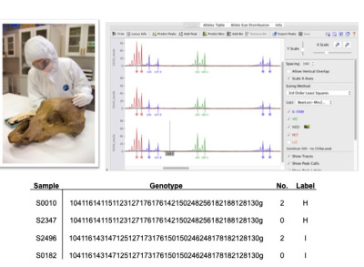
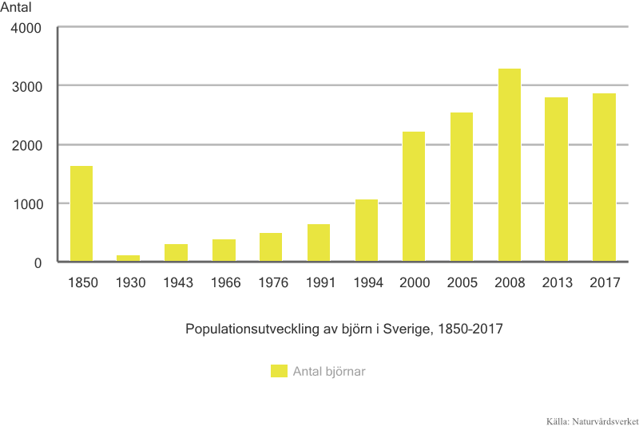
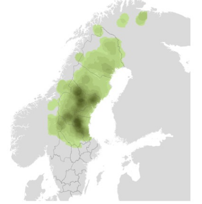
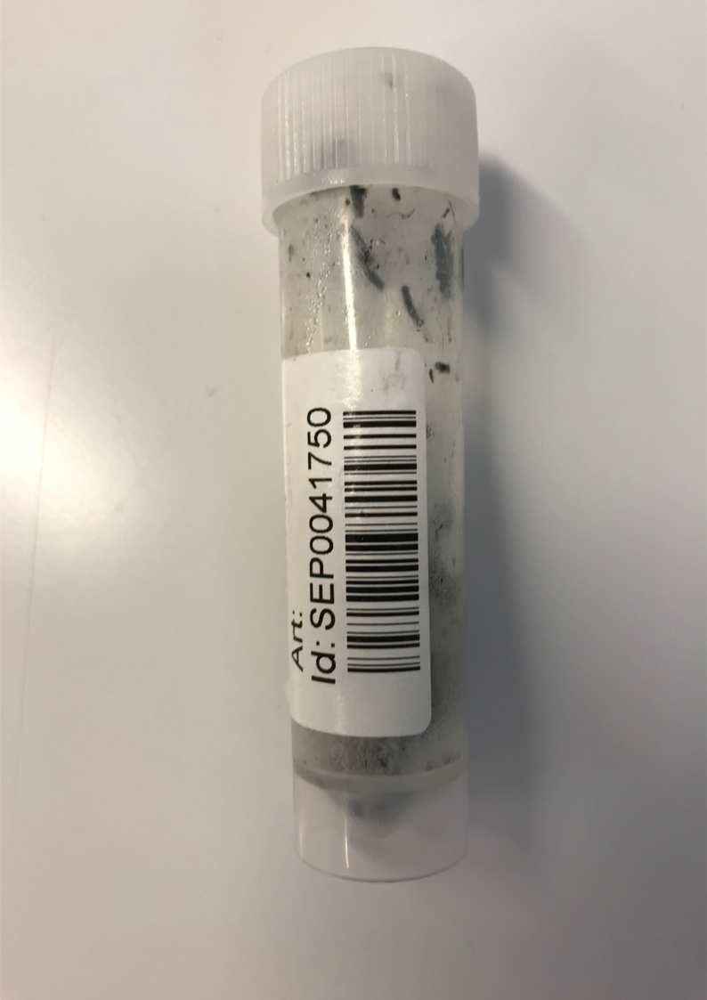

```{r setup, include=FALSE}
library(flexdashboard)
```

### Under hösten samlar svenska jägare in björnspillning för DNA-analys

.pull-left[

]
.pull-right[

]

---

### Alla spillningsprover får en unik kod och har GPS koordinater

.pull-left[

- Flera tusen prover per år
- De allra flesta är prover är björn, men även spillningsprover från räv, hund och älg har skickats in.
]
.pull-right[


]


---

### I spillningen finns DNA spår både från björnens föda och från björnen själv


---

### Genetisk profil (DNA fingeravtryck)

.pull-left[
- Från DNA kan man se att spillningen är från björn och om det är en hane eller en hona
- Det finns små skillnader i den genetiska profilen mellan björnar som gör att man kan avgöra från vilken individ spillningen kommer.
- Antalet olika genetiska profiler som hittas ger information om hur många björnar som finns.
]
.pull-right[

]

---

### Antal björnar i Sverige



---

### Var finns björnarna?

.pull-left[

]

.pull-right[
- I mörka områden är det relativt mycket björn
- I södra Sverige sker ingen regelbunden inventering
- Baserat på bland annat dessa resultat förvaltar Naturvårdsverket den svenska björnpopulationen.
]

---

### Resultat sparas i en gemensam databas för Sverige och Norge och finns på rovbase.se

.pull-left[

]

.pull-right[

]